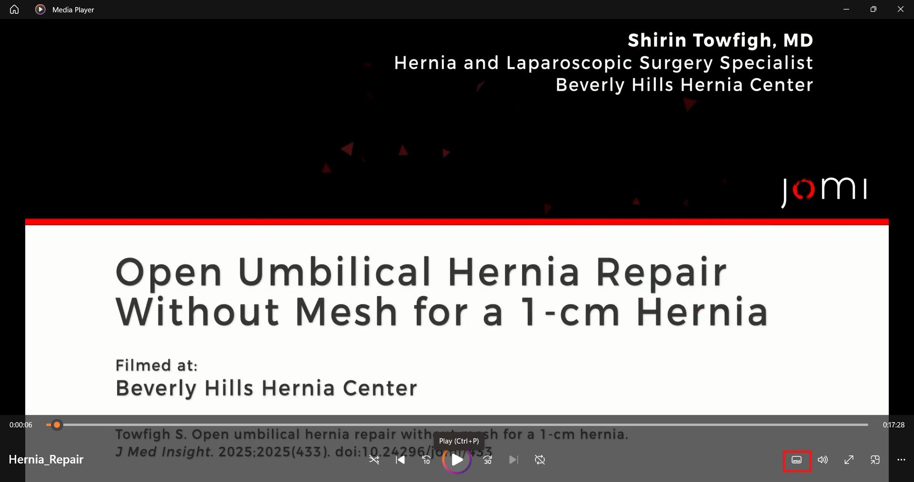
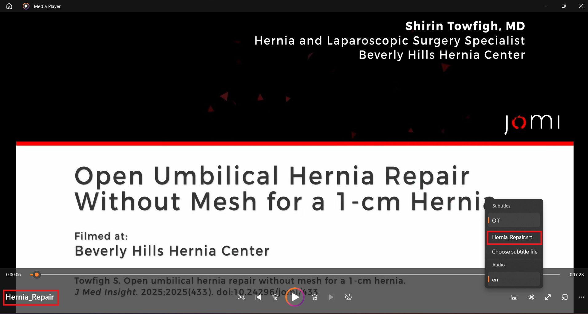
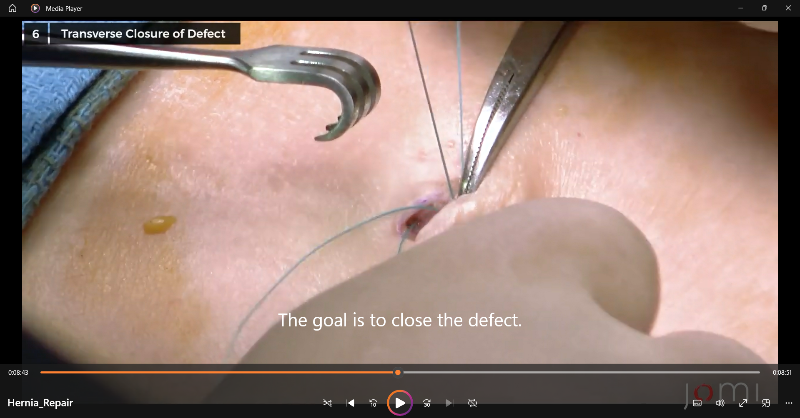
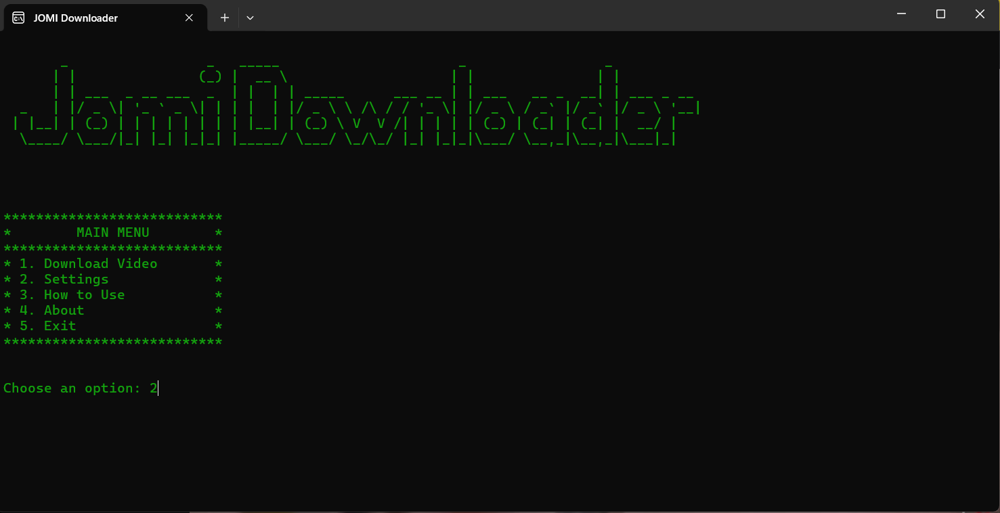
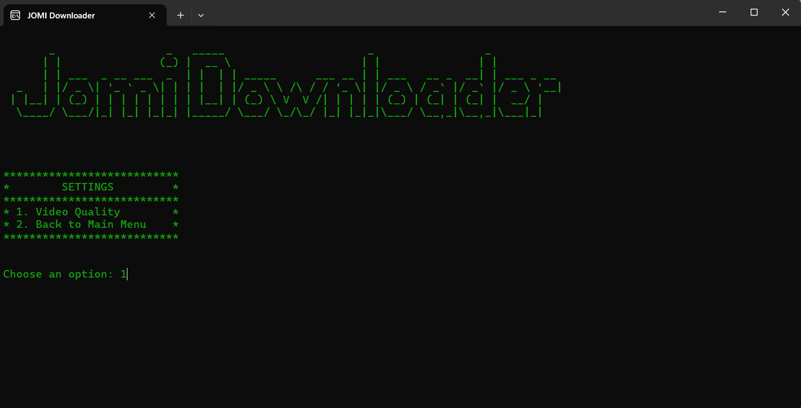
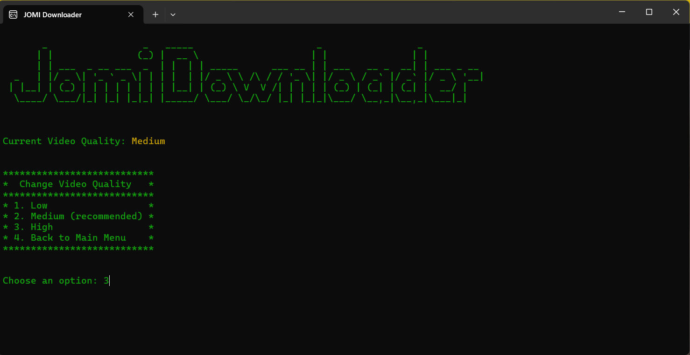
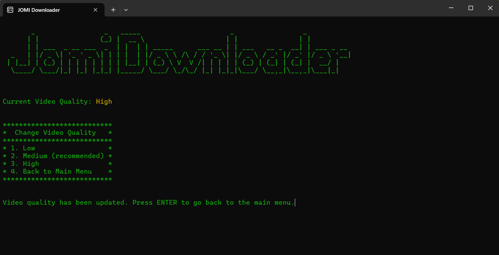

# JOMI Downloader

## Background
[JOMI](https://jomi.com/) stands for *Journal Of Medical Insight*. This journal is an online educational platform focused on high-quality surgical education. It provides peer-reviewed, step-by-step videos of real surgical procedures, performed by expert surgeons and accompanied by detailed explanations of anatomy, indications, operative steps, and postoperative considerations.

**Access is typically paid and requires subscriptions.** This is what this software intends to solve. It allows any medical student to access any video on the website for **FREE**, in HD quality, and with subtitles
by simply entering the URL for the video page. Note that this software is for educational purposes only.

## NEWS / CHANGELOG
#### February 1, 2026 (v1.2.2)
1. Breaking bug fixes following an update to JOMI's website structure.

**ALL VERSIONS PRIOR TO THIS VERSION NO LONGER WORK.**

#### JANUARY 5, 2026 (v1.2.1)

1. UI enhancement in the post-download screen.
2. Minor edge-case error handling in the user settings configuration.

#### DECEMBER 29, 2025 (v1.2.0)

1. Audio stuttering bug has been fixed (audio is now completely smooth).
2. Videos are now saved as ".mp4" instead of ".ts"
3. New "settings" feature added to the main menu (currently has video quality adjustment only).

#### DECEMBER 25, 2025 (v1.1.0)

1. JOMI Downloader now shows a neat progress bar for the download progress, instead of the primitive text spam display.

#### DECEMBER 16, 2025 (pre-release)

1. New "video subtitles download" feature has been added. Subtitles are saved as a ".srt" file in the same folder, with the same name as that of the video. You can now enable subtitles in your video player by selecting this ".srt" file.

## Installation
If you are not interested in going over the details of local Python setup and would like to easily and quickly use JOMI Downloader,
check the latest release [here](https://github.com/Coding-Doctor-Omar/JOMI-Downloader/releases/tag/v1.2.1), or check the [JOMI Downloader telegram bot](https://t.me/jomi_downloader_bot).

Otherwise, if you like to setup Python on your device and run the Python files directly, follow the 4 steps below:

1. Make sure you have [Python](https://www.python.org/) installed on your computer.
2. Make sure 'main.py', 'jomi_scraper.py', 'setup.py', and 'requirements.txt' are downloaded and in a common folder.
3. Run 'setup.py' to automatically install the required dependencies for the software.
4. Run 'main.py' to launch the application.

## Usage
To navigate the different menu screens in the app, simply type the number of the option you want and press
ENTER. This rule applies to all menu pages in the app. Below is an example for how to download a video using JOMI Downloader
(use the same logic for the settings page).

To download a JOMI video, follow these steps (screenshots are shown at the end):

1. Once you launch the software, type '1' and press ENTER.
2. You will be asked to provide the URL for the JOMI video page. Paste the URL and press ENTER.
3. You will then be asked to provide a name for the output video. Type the name without an extension and press ENTER.
4. Sit back and relax while the downloader downloads the video and its captions for you.
5. Once the video is downloaded, you will see a message saying 'Download Complete!'. Once you see this, press ENTER to go back to the main menu.
6. The video will be saved in the same folder as a ".mp4" video file, and the subtitles file will be saved in the same folder as a ".srt" file with the same name as the video.

## Screenshots

Step 1:

Step 2:

Step 3:

Step 4:

Video Played after Being Downloaded:

## Settings
Currently, the settings menu has 1 item: the Video Quality. This option allows the user
to choose the quality of the videos that are downloaded. The user's preferences are retained even if the user restarts the app.
There are 3 options for the
quality: Low, Medium, and High. 

The **low quality** option downloads a low quality (360p) video with a small size and fast download.

The **medium quality** option downloads an HD video (720p) with a moderate size and a moderate download time. This is the recommended option.

The **high quality** option downloads a full HD video (1080p), but with a huge size and much longer download time.

## Other Screenshots
About Screen:

How to Use Screen:

