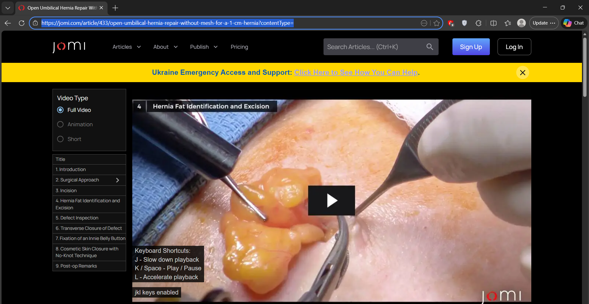
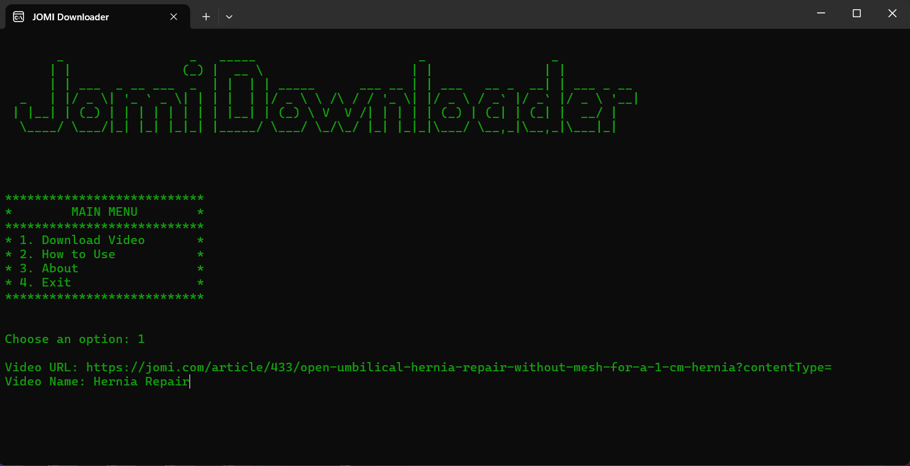
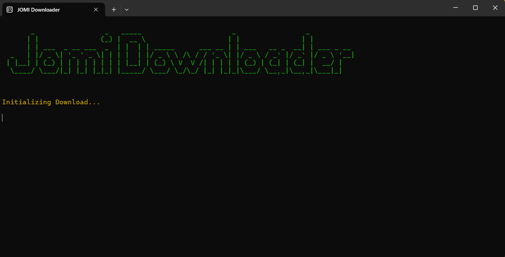
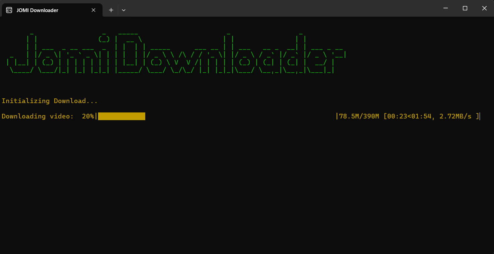
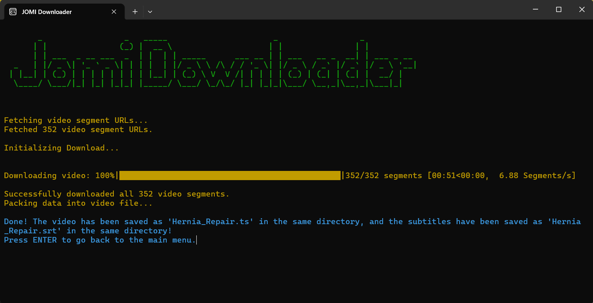
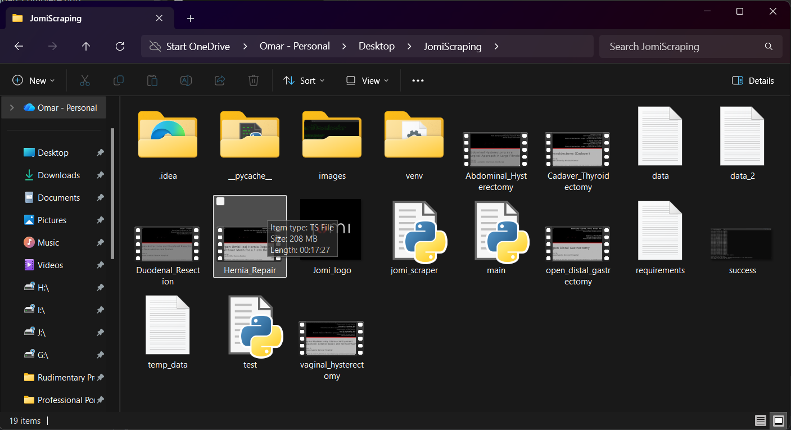
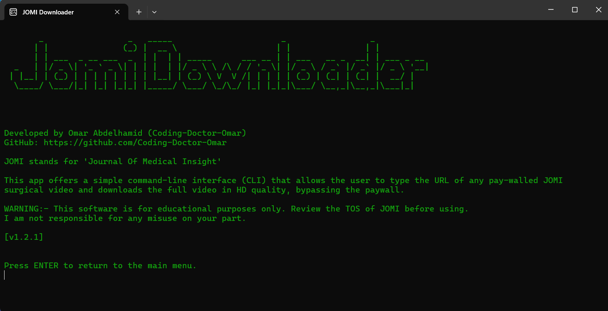
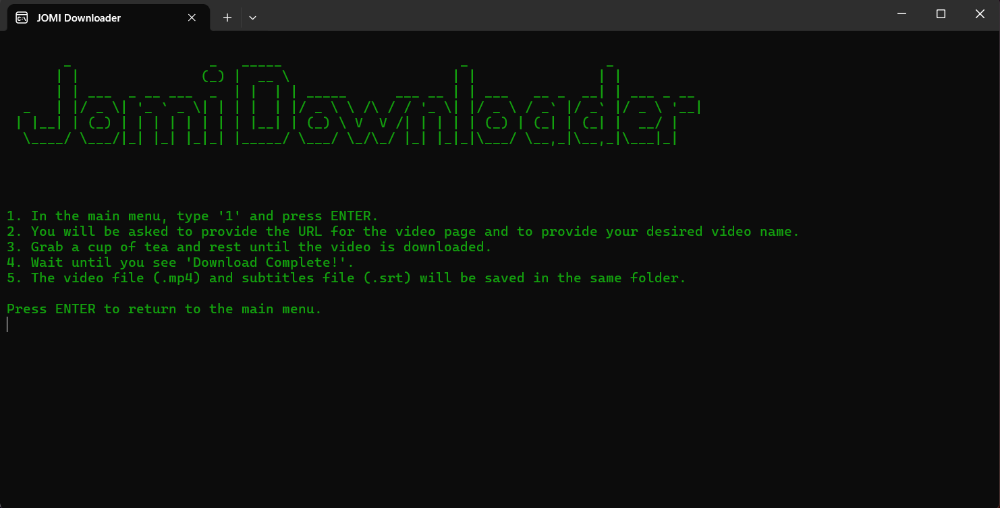

# JOMI Downloader

## NEWS
--- SOFTWARE UPGRADE ON DECEMBER 16, 2025 ---

JOMI Downloader now also downloads the video captions and saves them in a ".srt" file in the same directory as the video file and with the same name as the video file.

You can now watch your surgical video with captions by just enabling captions in your video player and selecting the ".srt" file!

## Background
[JOMI](https://jomi.com/) stands for *Journal Of Medical Insight*. This journal is an online educational platform focused on high-quality surgical education. It provides peer-reviewed, step-by-step videos of real surgical procedures, performed by expert surgeons and accompanied by detailed explanations of anatomy, indications, operative steps, and postoperative considerations.

JOMI is designed primarily for medical students, residents, and practicing surgeons, offering a realistic view of surgery as it happens in the operating room. The platform covers multiple specialties (e.g., general surgery, orthopedics, OB/GYN, urology, neurosurgery) and emphasizes clinical decision-making, surgical technique, and intraoperative anatomy.

Access is typically paid and requires subscriptions. This is what this software intends to solve. It allows any medical student to access any video on the website for FREE, in HD quality, and with subtitles
by simply entering the URL for the video page. Note that this software is for educational purposes only.

## Installation
1. Make sure you have [Python](https://www.python.org/) installed on your computer.
2. Make sure 'main.py', 'jomi_scraper.py', 'setup.py', and 'requirements.txt' are downloaded and in a common folder.
3. Run 'setup.py' to automatically install the required dependencies for the software.
4. Run 'main.py' to launch the application.

## Usage
To download a JOMI video, follow these steps (screenshots are shown at the end):

1. Once you launch the software, type '1' and press ENTER.
2. You will be asked to provide the URL for the JOMI video page. Paste the URL and press ENTER.
3. You will then be asked to provide a name for the output video (optional). Type the name without an extension and press ENTER.
4. Sit back and relax while the downloader downloads the video for you.
5. Once the video is downloaded, you will see a message in blue saying 'Done! The video has been saved as ...'. Once you see this, press ENTER to go back to the main menu.
6. The video will be saved in the same directory as 'main.py' as a '.ts' video file.

## Screenshots
Step 1:

Step 2:

Step 3:

Step 4:

Video in Folder:

## Other Screenshots

About Screen:

How to Use Screen:
